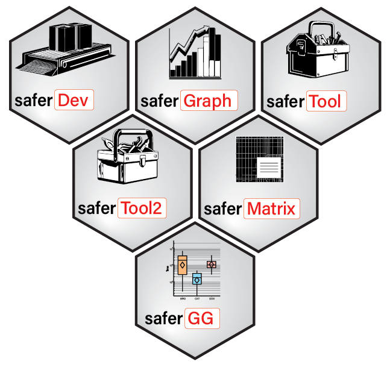

# The safer project <a href=""></a>

## Why the safer project?

[R](https://www.r-project.org) is a permissive programming language: it will 'try to work' in many situations and returns something, when other programming languages would have returned an error. This advantage partly explains its success, as it is commonly used by non programers. But it comes with several problems which could soften reproducibility or consistency aspects:
- Non intuitive behaviors. Example of the [`sample()`](http://127.0.0.1:25073/library/base/html/sample.html) function:
    ```
    set.seed(16)
    sample(1:10, size = 1) # select a single value among integers 1 to 10
    ```
    `[1] 1`
    This result is intuitive: a single value has been chosen between 1 and 10. Another intuitive example:
    ```
    sample(1, size = 2) # select 2 values among the single value 1
    ```
    <pre>Error in sample.int(x, size, replace, prob) : 
    cannot take a sample larger than the population when 'replace = FALSE'</pre>
    The error message is intuitive. However, with this example:
    ```
    sample(8, size = 2) # select 2 values among the single value 8
    ```
    <pre>[1] 4 6</pre>
    The result is non intuitive, with no warning message.
<br /><br />
- Lack of control of the arguments of functions or presence of the `...` argument in functions. Example with the `sum()` or `paste()` functions:
    ```
    > sum(1, 2, na.rm = TRUE) # sum of the value 1 and 2 with the use of the argument na.rm = TRUE, which removes any NA before summing.
    [1] 3
    
    > sum(1, 2, na.rn = TRUE) # the returned result, with no warning message, is non intuitive for a non informatician
    [1] 4
    
    > paste(c("a", "b"), collapse = "|") # collapse of the two strings "a" and "b" with "|" as separator
    [1] "a|b"
    
    > paste(c("a", "b"), colapse = "|") # the returned result, with no warning message, is non intuitive for a non informatician
    [1] "a |" "b |"
    ```
    Another example with the [`range()`](https://bugs.r-project.org/show_bug.cgi?id=17654) function.
- Weak control of objects with identical names in the R scope. Example:
    ```
    > mean <- function(...){sum(...)}
    > mean(1, 2) # the mean() function exists in R. But the new mean() function created is used with no warning message
    [1] 3
    ```
- Lack of explicit error messages. Example:
    ```
    > fun1 <- function(x){ # creation of the a() function which returns the value of the input x, except if x == 0, where it returns bob which does not exists -> error
    +     if(x == 0){
    +         return(bob)
    +     }else{
    +         print(x)
    +     }
    + }
    > fun2 <- function(x){fun1(x)} # # creation of the fun2() function which uses fun1()
    > for(x in 3:0){ # loop that print the value 3 to 0 using fun2(). The error message does not mention that fun2(x) generated the error in the loop
    +     fun2(x)
    + }
    [1] 3
    [1] 2
    [1] 1
    Error in fun1(x) : object 'bob' not found
    ```

The safer project gathers R functions of class S3 with a similar encoding that better controls their expected behavior.

## Features of the safer functions

Functions of class S3 from the safer project present the same encoding structure before the 'main' code section, which tackle the aspects described above, including:
- Reproducibility
    - Package systematically indicated for any used function (R Scope seeking non authorized). Example `base::paste()` instead of `paste()`.
    - Argument `safer_check` added, that checks 1) the presence in local R library folders of all the non basic functions and corresponding packages used in the code and 2) that all the classical R operators (`<-`, `(`, etc.) are not overwritten by other packages, since these packages always preceed the base R items in the R scope. Basic functions of R can be overwritten by other packages, since safer functions use the `::` writting for all functions, thus controlling the R scope.
    - Seeding of the random number generator by protecting potential seeding in the global environment.
- Intuitiveness
    - Argument `...` not authorized.
- Explicit messages
    - Name of the function and corresponding package returning error and warning messages.
    - All warning messages added in the error message string.
    - explicit error messages, following argument checking, if: 
        - No values for arguments with no default values.
        - Unexpected class, type, mode, length, restricted values panel, kind of numeric values in addition to the distinction between 'integer' and 'double' (proportion only? Inf values authorized? negative values authorized?).
        - Unauthorized `NA` (among other values or as unique value).
        - Unauthorized `NULL` value.
        - Unexpected structure of complex objects, like data frames and lists.

## safer Packages

- [saferDev](https://github.com/safer-r/saferDev): R function and pipeline development.
- [saferMatrix](https://github.com/safer-r/saferMatrix): matrix handling.
- [saferGraph](https://github.com/safer-r/saferGraph): classical graphic handling.
- [saferTool](https://github.com/safer-r/saferTool): basic tools.
- [saferTool2](https://github.com/safer-r/saferTool2): sophisticated tools.

