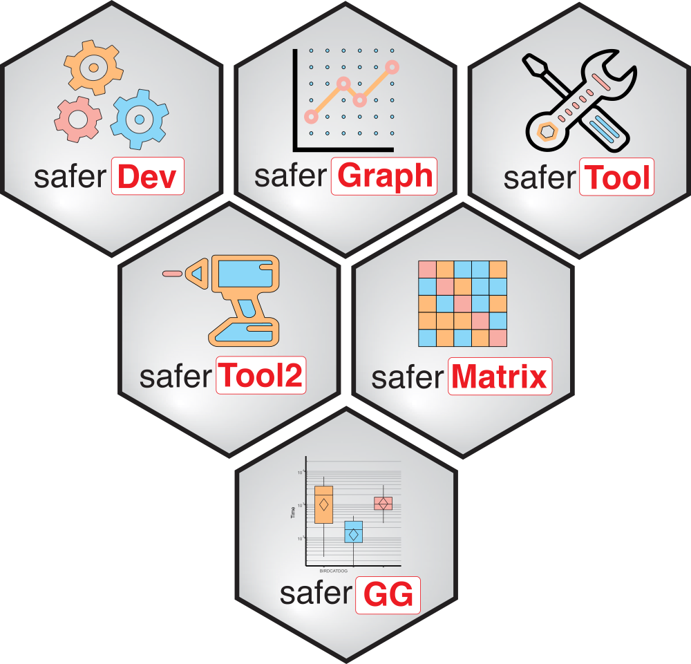

# The safer project <a href=""></a>

## Why the safer project?

[R](https://www.r-project.org) is a permissive programming language: it will 'try to work' in many situations and returns something, when other programming languages would have returned an error. This advantage partly explains its success, as it is commonly used by non programers. But it comes with several problems which could soften reproducibility or consistency aspects:
- **Non intuitive behaviors.**

    - Example with the `sample()` function:
    ```
    set.seed(16)
    sample(1:10, size = 1) # select a single value among integers 1 to 10
    ```
    <pre>[1] 1</pre>
    This result is intuitive: a single value has been chosen between 1 and 10. Another intuitive example:
    ```
    sample(1, size = 2) # select 2 values among the single value 1
    ```
    <pre>Error in sample.int(x, size, replace, prob) : 
    cannot take a sample larger than the population when 'replace = FALSE'</pre>
    The error message is intuitive. However, with this example:
    ```
    sample(8, size = 2) # select 2 values among the single value 8
    ```
    <pre>[1] 4 6</pre>
    The result is non intuitive, with no warning message.

    - Example with the `all()` and `any()` functions:
    ```
    all(NA, na.rm = TRUE) # result identical with all(c(NA, NA), na.rm = TRUE)
    ```
    <pre>[1] TRUE</pre>
    The result is not intuitive. In fact, the `all()` function returns `TRUE` when empty:
    ```
    all() # result identical with all(logical())
    ```
    <pre>[1] TRUE</pre>
    Which is hard to handle when using `all()` in a `if(){}` condition statement.

    To the opposite, but also hard to handle is the `any()` function that returns `FALSE` when empty:
    ```
    any() # result identical with any(logical())
    ```
    <pre>[1] FALSE</pre>
    A more convenient behavior would have been an error message, or at least a warning.
<br /><br />
- **Lack of control of the arguments of functions or presence of the `...` argument in functions.**

    Example with the `sum()` function:
    ```
    sum(1, 2, na.rm = TRUE) # sum of the value 1 and 2 with the use of the argument na.rm = TRUE, which removes any NA before summing
    ```
    <pre>[1] 3</pre>
    This result is the one expected. However, with this example:
    ```
    sum(1, 2, na.rn = TRUE) # na.rm replaced by na.rn (typo)
    ```
    <pre>[1] 4</pre>
     The returned result, with no warning message, is non intuitive for a non informatician.

    Another example with `paste()`:
    ```
    paste(c("a", "b"), collapse = "|") # collapse of the two strings "a" and "b" with "|" as separator
    ```
    <pre>[1] "a|b"</pre>
    This result is the one expected. However, with this example:
    ```
    paste(c("a", "b"), colapse = "|") # collapse replaced by colapse (typo)
    ```
    <pre>[1] "a |" "b |"</pre>
    The returned result, with no warning message, is non intuitive for a non informatician.

    Another example with the `range()` function [`here`](https://bugs.r-project.org/show_bug.cgi?id=17654).
<br /><br />
- **Weak control of objects with identical names in the R scope.**

    Example:
    ```
    mean <- function(...){sum(...)}
    mean(1, 2)
    ```
    <pre>[1] 3</pre>
     The `mean()` function exists in R. But the new `mean()` function created is used with no warning message.

    Another example with the order of imported packages:
    ```
    library(dplyr)
    library(plyr)
    counts=data.frame(group = c(rep("C1",4), rep("C2", 4)),A = rep(1,8), B = rep(2,8))
    counts %>% group_by(group) %>% summarize(avg1 = mean(A), avg2 = mean(B)) # mean of A and B for each C1 and C2
    ```
    <pre>  avg1 avg2
    1    1    2</pre>
    The returned result is not the expected tibble. The correct results is obtained with:
    ```
    counts %>% group_by(group) %>% dplyr::summarize(avg1 = mean(A), avg2 = mean(B)) # mean of A and B for each C1 and C2
    ```
    Or by opening a new R session and by inversing the order of the imported packages:
    ```
    library(plyr)
    library(dplyr)
    counts=data.frame(group = c(rep("C1",4), rep("C2", 4)),A = rep(1,8), B = rep(2,8))
    counts %>% group_by(group) %>% summarize(avg1 = mean(A), avg2 = mean(B)) # mean of A and B for each C1 and C2
    ```
    <pre># A tibble: 2 × 3
      group  avg1  avg2
      <chr> <dbl> <dbl>
    1 C1        1     2
    2 C2        1     2</pre>
    Indeed, two differents functions with the same name `summarize()` exist in the *dplyr* and *plyr* packages. Dramatically, the one used by default is the one from the last imported package, here *plyr*, emphazising that a result in R can depend on the order of the imported packages. A message following `library(dplyr) ; library(plyr)` is displayed, but such messages are frequently removed in scripts:
    ```
    suppressMessages(library(dplyr))
    suppressMessages(library(plyr))
    ```

- **Lack of explicit error messages.**

    Example:
    ```
    fun1 <- function(x){ # creation of the fun1() function which returns the value of the input x, except if x == 0, where it returns bob which does not exists -> error
        if(x == 0){
            return(bob)
        }else{
            print(x)
        }
    }
    fun2 <- function(x){fun1(x)} # # creation of the fun2() function which uses fun1()
    fun2(0)
    ```
    <pre>Error in fun1(x) : object 'bob' not found</pre>
    The error message does not mention that `fun2(x)` generated the error.
<br /><br />

The safer project gathers R functions of class S3 with a similar encoding that better controls their expected behavior.
<br /><br />
## Features of the safer functions

Functions of class S3 from the safer project present the same encoding structure before the 'main' code section (see the [backbone.R](./backbone.R) file), which tackle the aspects described above, including:
- Reproducibility
    - Package systematically indicated for any used function (R Scope seeking controlled). Example `base::paste()` instead of `paste()`.
    - All the arguments of functions written, even if default values are used, to prevent argument name change or default value change (like the `stringsAsFactors` argument of `read.table()`, for which default value changed from `TRUE` to `FALSE` since R version 4.0). Example `base::sum(1:3, na.rm = FALSE)` instead of `base::sum(1:3)`.
    - Argument `safer_check` added in each safer function, that checks 1) the presence in local R library folders of all the non basic functions and corresponding packages used in the code and 2) that all the classical R operators (`<-`, `(`, etc.) are not overwritten by other packages, since these packages always preceed the base R items in the R scope.
    - Seeding of the random number generator using an argument each time randomness is used, and protecting potential seeding in the global environment.
- Intuitiveness
    - Argument `...` not authorized in safer functions.
    - Argument with `NA` as only value not authorized in safer functions, in order to deal with `if(all(X, na.rm = TRUE)){}` that would return `TRUE` if `X` is only made of `NA`.
- Explicit messages
    - Name of the functions and corresponding packages in all error and warning messages, including the embedding functions, so that we better know the origin of the message.
    - Explicit error messages,
    - All warning messages added in the error message string.
    - Strong checking of each argument, for instance: 
        - Values for arguments with no default values.
        - Expected class, type, mode, length, restricted values panel, kind of numeric values in addition to the distinction between 'integer' and 'double' (proportion only? Inf values authorized? negative values authorized?).
        - Authorized `NA` (among other values, never as unique value) or not.
        - Authorized `NULL` value or not.
        - Authorized empty value or not (empty list for instance).
        - Authorized `""` value in vector of characters or not.
        - Expected structure of complex objects, like data frames and lists.
<br /><br />
## Make a safer function

- Recover the [Backbone.R code](https://github.com/safer-r/.github/tree/main/profile).
- Follow the instructions [here](https://gael-millot.github.io/protocols/docs/Protocol%20167-rev0%20BACKBONE%20OF%20SAFER%20R%20FUNCTIONS.htm).
- Warning: all the safer functions inside another safer function must have the safer_ckeck argument set to FALSE, to avoid repetitive checkings that would exponentially increase the function execution time.
<br /><br />
## Make a safer script

- Could this script be written as a function?
<br /><br />
## safer Packages

Functions from all these packages use the safer backbone and, thus, respect the criteria of the safer project.

- [saferDev](https://github.com/safer-r/saferDev): R function and pipeline development.
- [saferMatrix](https://github.com/safer-r/saferMatrix): matrix handling.
- [saferGraph](https://github.com/safer-r/saferGraph): classical graphic handling.
- [saferTool](https://github.com/safer-r/saferTool): basic tools.
- [saferTool2](https://github.com/safer-r/saferTool2): sophisticated tools.
- [saferGG](https://github.com/safer-r/saferGG): ggplot2 graphics.

